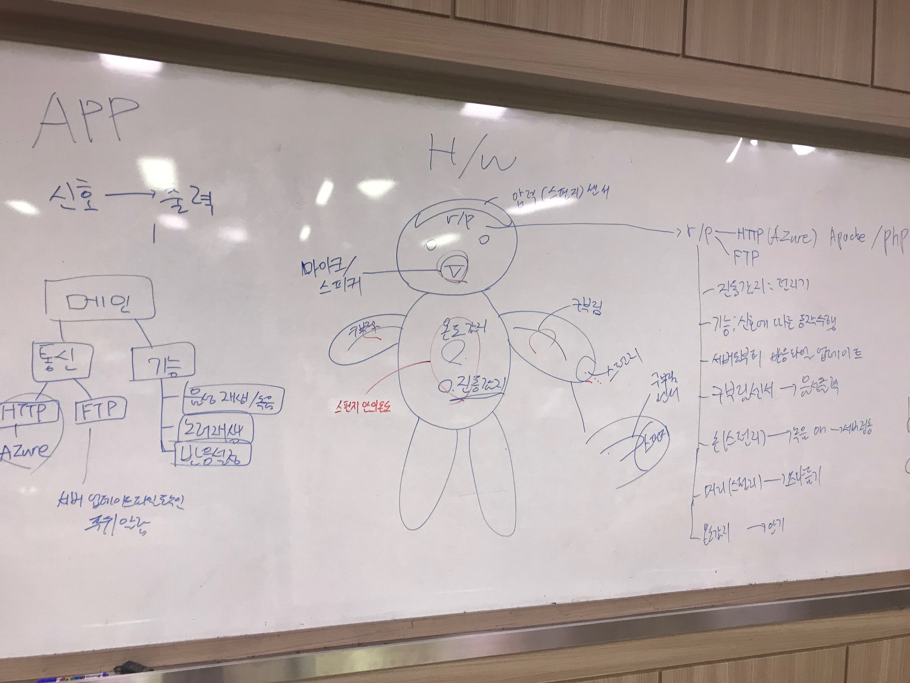
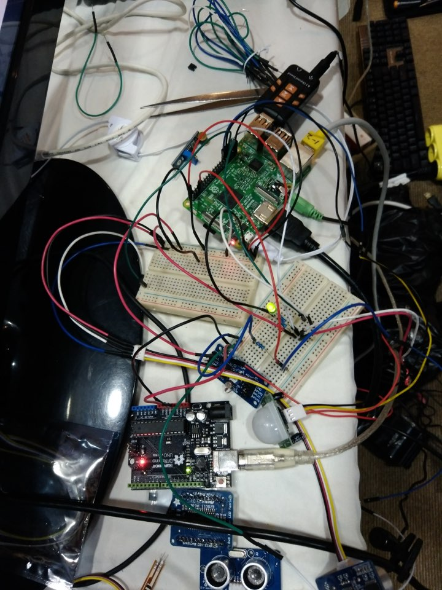

# PPomi 第３回GIF(Global Innovator Festa)大会(チーム)

- Demo (Youtube) : 
    - https://youtu.be/5DH2yKmZitU
	- https://youtu.be/NT4bUG3TRr4
	- https://youtu.be/MDVPfxKGK5E

- 主催機関 : 大邱(EXCO) + マイクロソフト
- 大会の概要 : マイクロソフトとともにするIoTコンテスト
- 開発期間 : 一週間(2017.10.30 ~ 2017.11.04)
- 参考サイト : http://gifesta.com
- 企画書リンク
	- https://docs.google.com/document/d/1v6JEy6B10sG-_-AaCFAu8MQvV6Ayccs-89ksipQYsrU/edit?usp=sharing  

- 使用技術
    - Azure
    - PHP
    - Mysql
    - Python
    - RaspberryPi
    - firebase
    - Android
 
- 開発写真
    -  
    -  
    - 
